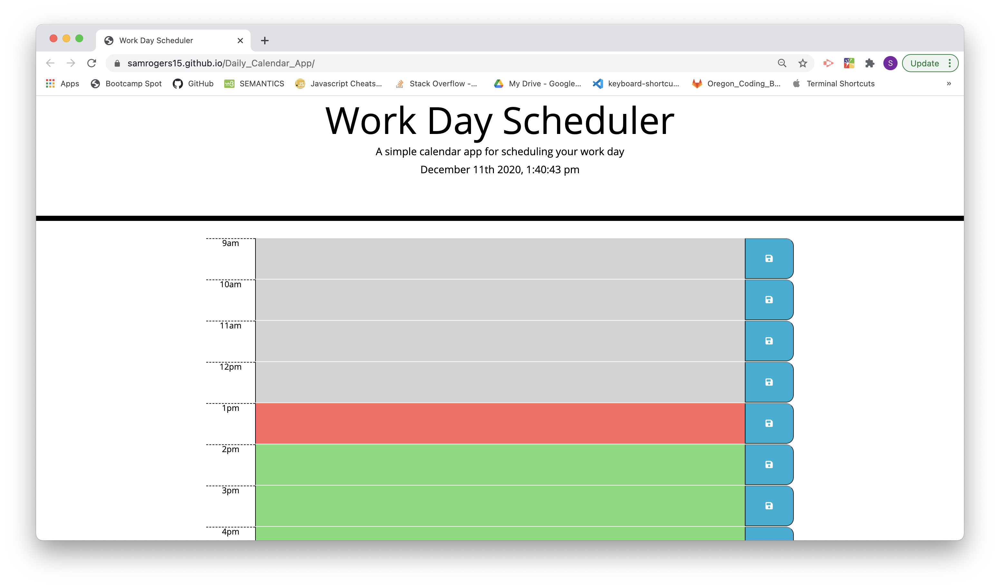

# Daily Calendar Application
> This program allows a user to put together a schedule of their daily tasks. The program displays the time of day at that current moment and keeps a running tally of the time as it continues to pass. If a user enters in a specific calendar item and clicks the save button, the text content of that calendar item gets saved to the user's local storage. Upon refreshing the page, the calendar item will still be saved on the calendar (it will only disappear if the user clears their browser's local storage). Additionally, the formatting of the schedule will update as the hours in the day pass by - future calendar items will have a different format than calendar items in the past. Additinoally, calendar items that are reflective of the current hour also have a different format.
 
## Table of contents
* [General info](#general-info)
* [Screenshots](#screenshots)
* [Technologies](#technologies)
* [Live link](#live-link)
* [Contact](#contact)

## General info
This program was created with jQuery and uses an html page and a CSS style sheet. The program stores information in local storage and appends information that is stored in local storage when the calendar is refreshed. Additionally, the program uses the Moment.js library to work with dates and times.

## Screenshots

## Technologies
* HTML
* CSS
* JQuery

## Live link
https://samrogers15.github.io/Daily_Calendar_App/

## Contact
Created by Sam Rogers (https://www.linkedin.com/in/samuelerogers/) - feel free to contact me.